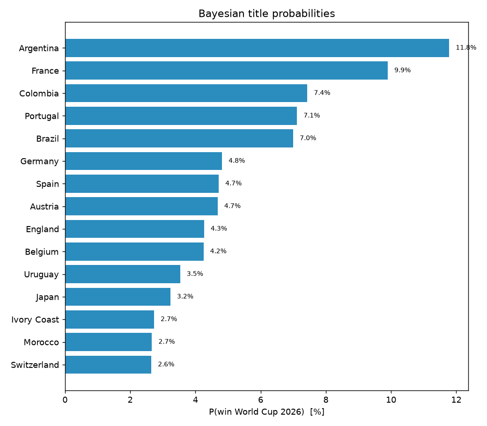

# 🏆 World Cup 2026 — Champion Tracker

_A living, state-aware forecast. Conditioned on the **28 matches played so far**: completed group games are held fixed; the rest of the tournament is simulated from a Bayesian goals model (squad-skill prior + current form + X/ESPN sentiment). Updated 2026-06-19._

## How to read this

1. **Next games** — predicted goals for the upcoming fixtures.
2. **The trophy** — each team's title probability, given everything that has already happened.

Both come from one model: goals are the primitive; the winner is a simulation over goals. See [METHODOLOGY.md](METHODOLOGY.md).

## Title odds — conditioned on current results

| Team | Quarter | Semi | Final | **Champion** |
|---|---|---|---|---|
| Argentina | 48% | 28% | 17% | **12%** |
| France | 47% | 26% | 15% | **10%** |
| Colombia | 45% | 23% | 12% | **7%** |
| Portugal | 39% | 20% | 11% | **7%** |
| Brazil | 43% | 22% | 11% | **7%** |
| Germany | 38% | 20% | 10% | **5%** |
| Spain | 33% | 17% | 9% | **5%** |
| Austria | 36% | 19% | 9% | **5%** |
| England | 36% | 18% | 9% | **4%** |
| Belgium | 35% | 18% | 9% | **4%** |
| Uruguay | 27% | 15% | 8% | **4%** |
| Japan | 28% | 14% | 7% | **3%** |

## Next games — predicted goals

| Date | Fixture | Pred goals (xG) | Likely | P(H/D/A) | Home form |
|---|---|---|---|---|---|
| 2026-06-20 | Netherlands v Sweden | 2.1-1.3 | 1-1 | 55%/21%/24% | steady |
| 2026-06-20 | Tunisia v Japan | 0.7-1.4 | 0-1 | 19%/28%/53% | cold |
| 2026-06-20 | Germany v Ivory Coast | 1.6-1.3 | 1-1 | 46%/24%/30% | red-hot |
| 2026-06-20 | Ecuador v Curaçao | 1.9-0.5 | 1-0 | 70%/21%/9% | steady |
| 2026-06-21 | Belgium v Iran | 1.9-0.8 | 1-0 | 64%/21%/15% | red-hot |
| 2026-06-21 | New Zealand v Egypt | 0.7-1.3 | 0-1 | 19%/29%/52% | cold |
| 2026-06-21 | Spain v Saudi Arabia | 1.4-0.5 | 1-0 | 62%/27%/12% | steady |
| 2026-06-21 | Uruguay v Cape Verde | 1.3-0.7 | 1-0 | 51%/29%/20% | steady |
| 2026-06-22 | France v Iraq | 2.1-0.4 | 1-0 | 76%/18%/6% | rising |
| 2026-06-22 | Norway v Senegal | 1.3-1.3 | 1-1 | 39%/26%/35% | rising |
| 2026-06-22 | Argentina v Austria | 1.7-1.1 | 1-1 | 50%/24%/26% | red-hot |
| 2026-06-22 | Jordan v Algeria | 0.8-1.9 | 0-1 | 15%/21%/64% | dipping |
| 2026-06-23 | Portugal v Uzbekistan | 1.9-0.5 | 1-0 | 70%/20%/10% | rising |
| 2026-06-23 | Colombia v Congo DR | 1.7-0.7 | 1-0 | 60%/24%/16% | rising |
| 2026-06-23 | England v Ghana | 2.1-0.7 | 1-0 | 68%/20%/12% | rising |
| 2026-06-23 | Panama v Croatia | 0.7-1.6 | 0-1 | 17%/25%/58% | dipping |
| 2026-06-24 | Morocco v Haiti | 1.7-0.7 | 1-0 | 60%/24%/16% | rising |
| 2026-06-24 | Bosnia-Herzegovina v Qatar | 1.5-1.1 | 1-1 | 46%/26%/29% | dipping |
| 2026-06-24 | Scotland v Brazil | 1.0-2.2 | 0-2 | 17%/20%/64% | rising |
| 2026-06-24 | South Africa v South Korea | 1.1-0.9 | 1-0 | 39%/31%/31% | dipping |
| 2026-06-24 | Mexico v Czechia | 1.8-0.9 | 1-0 | 57%/23%/19% | rising |
| 2026-06-24 | Canada v Switzerland | 1.5-1.3 | 1-1 | 42%/25%/33% | red-hot |

## Current group standings (played)

| Team | P | Pts | GD |
|---|---|---|---|
| Mexico | 2 | 6 | +3 |
| Canada | 2 | 4 | +6 |
| Switzerland | 2 | 4 | +3 |
| Germany | 1 | 3 | +6 |
| Sweden | 1 | 3 | +4 |
| United States | 1 | 3 | +3 |
| Norway | 1 | 3 | +3 |
| Argentina | 1 | 3 | +3 |
| Australia | 1 | 3 | +2 |
| France | 1 | 3 | +2 |
| Austria | 1 | 3 | +2 |
| Colombia | 1 | 3 | +2 |
| England | 1 | 3 | +2 |
| Scotland | 1 | 3 | +1 |
| Ivory Coast | 1 | 3 | +1 |
| Ghana | 1 | 3 | +1 |
| South Korea | 2 | 3 | +0 |
| Brazil | 1 | 1 | +0 |
| Morocco | 1 | 1 | +0 |
| Netherlands | 1 | 1 | +0 |
| Japan | 1 | 1 | +0 |
| Belgium | 1 | 1 | +0 |
| Egypt | 1 | 1 | +0 |
| Iran | 1 | 1 | +0 |
| New Zealand | 1 | 1 | +0 |
| Spain | 1 | 1 | +0 |
| Cape Verde | 1 | 1 | +0 |
| Saudi Arabia | 1 | 1 | +0 |
| Uruguay | 1 | 1 | +0 |
| Portugal | 1 | 1 | +0 |
| Congo DR | 1 | 1 | +0 |
| Czechia | 2 | 1 | -1 |
| South Africa | 2 | 1 | -2 |
| Bosnia-Herzegovina | 2 | 1 | -3 |
| Qatar | 2 | 1 | -6 |
| Haiti | 1 | 0 | -1 |
| Ecuador | 1 | 0 | -1 |
| Panama | 1 | 0 | -1 |
| Türkiye | 1 | 0 | -2 |
| Senegal | 1 | 0 | -2 |
| Jordan | 1 | 0 | -2 |
| Uzbekistan | 1 | 0 | -2 |
| Croatia | 1 | 0 | -2 |
| Paraguay | 1 | 0 | -3 |
| Iraq | 1 | 0 | -3 |
| Algeria | 1 | 0 | -3 |
| Tunisia | 1 | 0 | -4 |
| Curaçao | 1 | 0 | -6 |

## What feeds the prediction

- **Player skillsets** — squad ratings (pace/shooting/passing/…) and seniority form the model's prior, so squad quality shapes goals.
- **Current results** — the posterior is fit on matches through today and the simulation holds played games fixed.
- **Form + X/ESPN sentiment** — folded in as a small, capped goal-rate nudge (see `models/momentum.py`, `data/scouting.py`).
- **Charts:** `artifacts/champion_tracker.png` (title odds), `artifacts/forecast_probs.png`, `artifacts/calibration.png`.