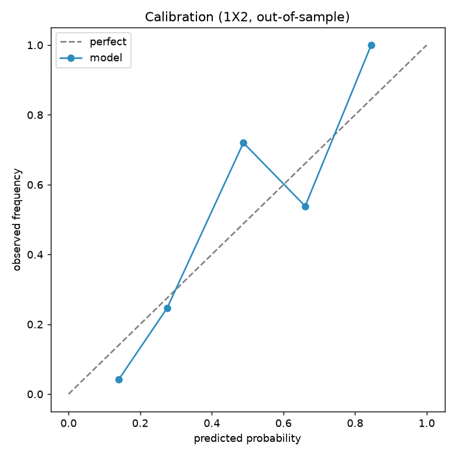
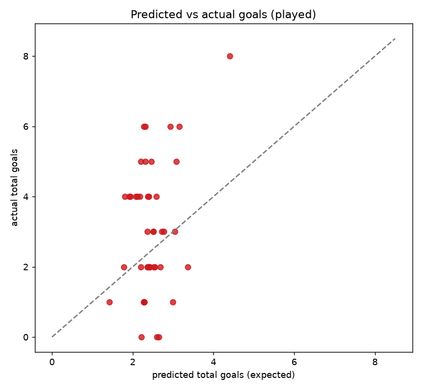
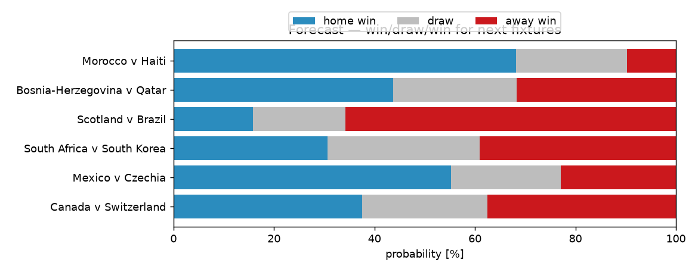

# WC 2026 — Tracking Analytics, Sentiment & Tactics

_Run after each matchday to track model calibration and read the next slate. Charts in `artifacts/`. Compiled 2026-06-23._

## Tracking charts

- **Calibration** (`artifacts/calibration.png`) — are our probabilities honest? Points on the diagonal = well-calibrated.
- **Predicted vs actual goals** (`artifacts/goals_pred_vs_actual.png`) — scatter of expected vs real total goals per played match.
- **Forecast win/draw/win** (`artifacts/forecast_probs.png`) — stacked 1X2 bars for upcoming fixtures.

**Tracking metrics (44 matches):** outcome hit-rate 61% · total-goals MAE 1.50. Re-run to update as results come in.

## Match sentiment & momentum (next fixtures)

| Fixture | Home form | Away form | Momentum edge |
|---|---|---|---|
| Morocco v Haiti | rising (+0.07) | steady (-0.03) | **Morocco** |
| Bosnia-Herzegovina v Qatar | dipping (-0.08) | cold (-0.18) | **Bosnia-Herzegovina** |
| Scotland v Brazil | steady (+0.04) | red-hot (+0.14) | **Brazil** |
| South Africa v South Korea | dipping (-0.07) | dipping (-0.05) | **even** |
| Mexico v Czechia | rising (+0.09) | steady (-0.05) | **Mexico** |
| Canada v Switzerland | red-hot (+0.16) | rising (+0.12) | **even** |

## Tactical read (next fixtures)

**Morocco v Haiti** — best shapes 4-3-3 vs 3-4-3.
  - Defence: home edge (81 vs 61) · Midfield: home edge (76 vs 63) · Attack: home edge (82 vs 65)
  - home controls midfield; home built around its defence, away around its attack.

**Bosnia-Herzegovina v Qatar** — best shapes 4-3-3 vs 4-4-2.
  - Defence: home edge (74 vs 60) · Midfield: home edge (78 vs 60) · Attack: home edge (77 vs 60)
  - home controls midfield; home built around its midfield, away around its defence.

**Scotland v Brazil** — best shapes 4-4-2 vs 4-4-2.
  - Defence: away edge (79 vs 85) · Midfield: away edge (78 vs 86) · Attack: away edge (75 vs 86)
  - away controls midfield; home built around its defence, away around its midfield.

**South Africa v South Korea** — best shapes 3-4-3 vs 3-4-3.
  - Defence: away edge (70 vs 73) · Midfield: away edge (70 vs 78) · Attack: away edge (73 vs 75)
  - away controls midfield; home built around its attack, away around its midfield.

**Mexico v Czechia** — best shapes 3-4-3 vs 4-4-2.
  - Defence: away edge (77 vs 78) · Midfield: home edge (80 vs 78) · Attack: home edge (82 vs 78)
  - midfield finely balanced; home built around its attack, away around its midfield.

**Canada v Switzerland** — best shapes 3-4-3 vs 3-5-2.
  - Defence: away edge (73 vs 78) · Midfield: away edge (74 vs 79) · Attack: away edge (75 vs 78)
  - away controls midfield; home built around its attack, away around its midfield.

## Keep working on it

- Re-run stages 13 → 14 after each matchday; calibration and MAE track model health over time.
- Sentiment is form-based for all teams + scouted for Mexico; add per-team scouting / X-collector output to enrich others.
- Tactical reads use coarse position buckets — see [METHODOLOGY.md](METHODOLOGY.md) for the upgrade path.